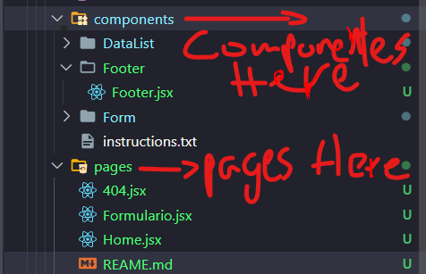

<h1>Intructions 💻🌐</h1>

<h3>En esta seccion se describe el orden en que deben ir las paginas</h3>

Es decir, primero Creas tus componentes y si despues los mergeas, desde los componentes obviamente,para que se puedan reutilizar.
Por ejemplo: Tienes una Pagina LLamada **"About"** Y resulta que te falta el footer de esta pagina, pero te das cuenta q hay un Componente en la carpeta **"Components"** LLamado Footer asi que puedes modificarlo o extender este componente haciendo reutilizable, puede ser pasandole _Props_ y Etc.

